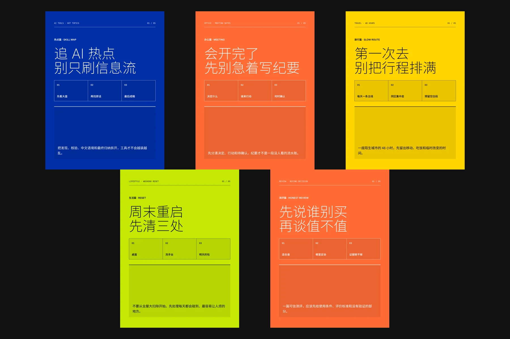
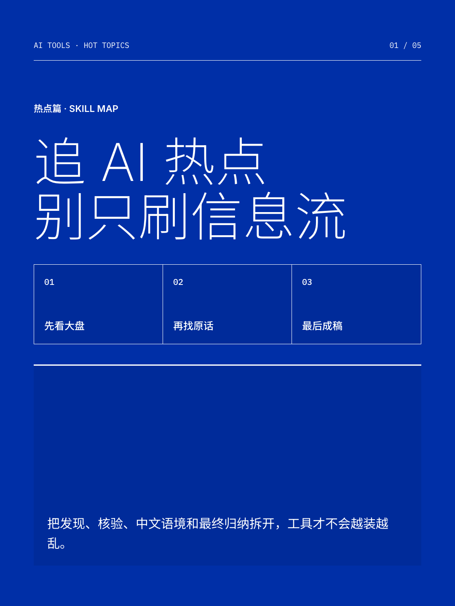
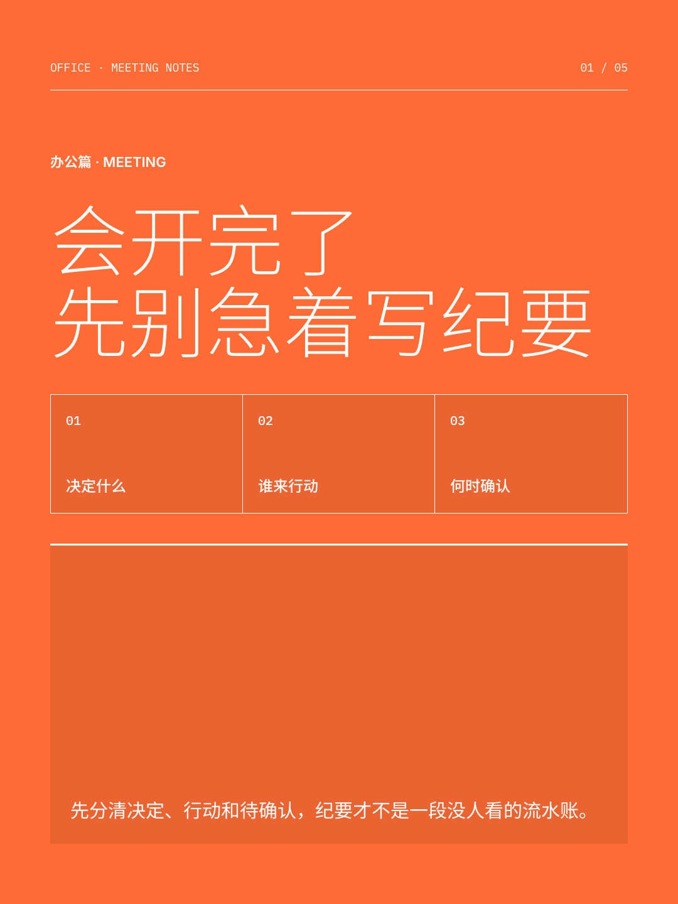
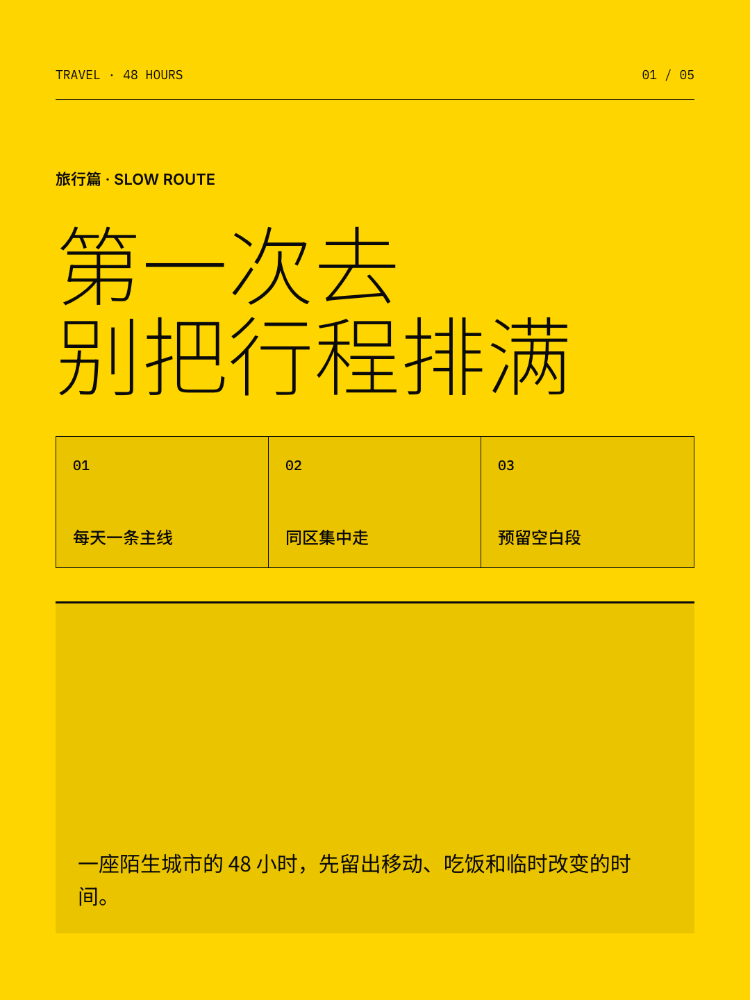
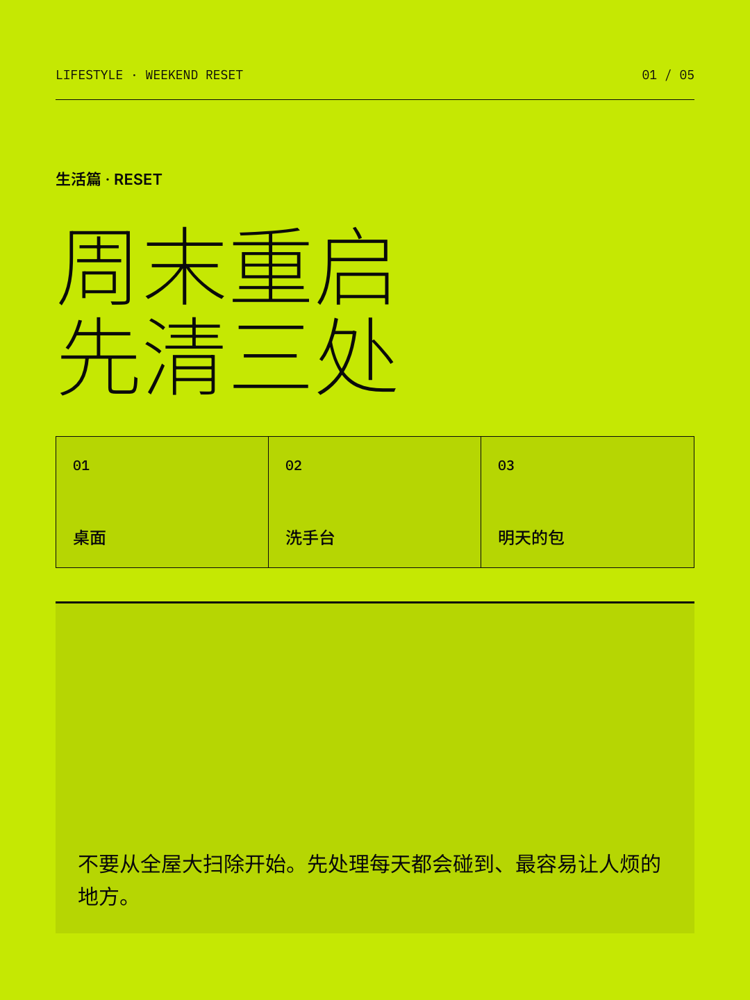
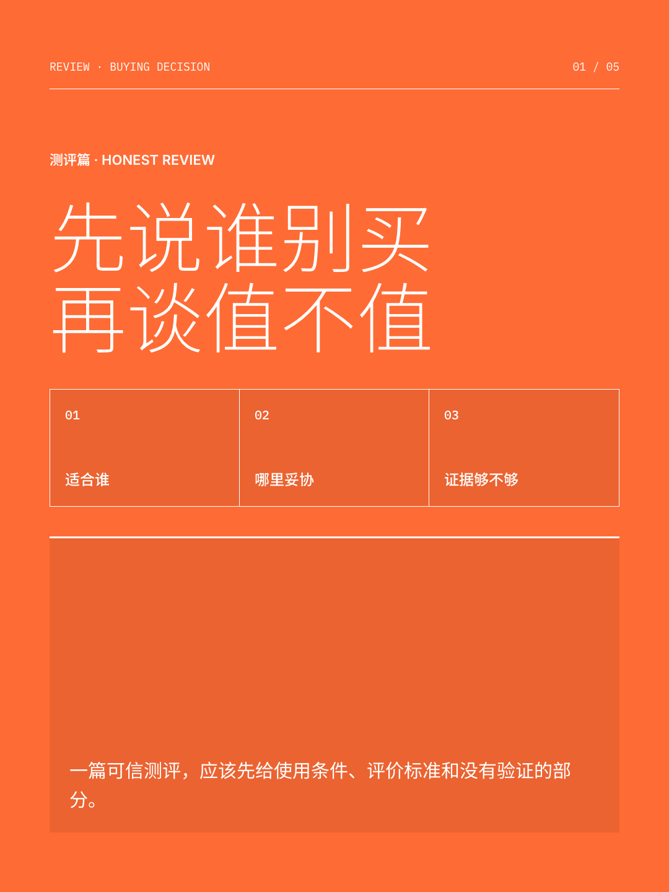

<div align="center">

[中文](./README.md) · **English**

# XHS Hot Skill

#### One topic in, 2-3 directions first, then a complete Xiaohongshu copy and visual package

[](./LICENSE)
[](#20-content-scenes)
[](#validation)
[](https://agentskills.io)



</div>

`xhs-hot-skill` turns a loose idea into an executable Xiaohongshu package. It routes the topic to one of 20 scene recipes, proposes 2-3 materially different editorial and visual directions, and waits for a choice. It then produces titles, 5-9 carousel pages, a 300-500-character Chinese post, tags, one interaction question, sources, risks, and a render brief.

This is not one universal “viral template.” AI tool lists, travel guides, skincare posts, and product reviews use different hooks, page structures, image strategies, and safety rules.

> Pair it with [guizang-social-card-skill](https://github.com/op7418/guizang-social-card-skill). XHS Hot Skill owns topic routing, structure, and copy; Guizang renders the selected direction as 1080x1440 social cards.

## Install in 30 seconds

```bash
npx skills add https://github.com/qijingyu0727/xhs-hot-skill --skill xhs-hot-skill -g -y
```

Recommended companion:

```bash
npx skills add https://github.com/op7418/guizang-social-card-skill --skill guizang-social-card-skill -g -y
```

Or ask an Agent with terminal access:

```text
Install https://github.com/qijingyu0727/xhs-hot-skill and verify SKILL.md, references/, data/, and agents/openai.yaml.
```

## Usage

### 1. Give it a topic

```text
Use $xhs-hot-skill for a post about AI search skills ordinary people can use.
```

The Skill returns 2-3 directions first. Each direction changes the angle, title promise, page order, visual system, and image strategy.

### 2. Choose a direction

```text
Choose B. Produce the full copy package and render it with guizang-social-card-skill.
```

The final package includes:

- 4-6 title alternatives
- 5-9 carousel pages
- a 300-500-character Chinese body
- a reusable prompt, checklist, route, or decision criteria
- 4-8 tags and one interaction question
- material requirements, sources, copyright notes, and safety risks
- a Guizang brief and, when available, 1080x1440 renders

## Examples

| AI tools | Office productivity | Travel guide |
| --- | --- | --- |
|  |  |  |

| Lifestyle | Product review |
| --- | --- |
|  |  |

All demo copy, graphics, and images are project-created or clearly labeled generated material. No third-party Xiaohongshu screenshots or original images are bundled.

## 20 content scenes

| Group | Scenes |
| --- | --- |
| Tech and efficiency | AI tools, digital/software, office productivity |
| Growth and knowledge | career/job search, study/exams, books/knowledge |
| Creation and travel | content/photography, travel guides, local discovery |
| Food and home | food/recipes, home/organization, renovation/renting |
| Style and body | fashion, beauty/skincare, fitness/fat loss, health/wellness |
| Relationships and decisions | emotional growth, parenting, personal finance, product reviews |

Every scene recipe defines its audience, title formulas, three direction archetypes, page structures, copy rhythm, image strategy, Editorial/Swiss routing, positive and negative evidence, safety boundaries, and a checklist.

## How it works

```text
one topic
  ↓
20-scene router
  ↓
2-3 copy × visual directions (wait for choice)
  ↓
titles + carousel + body + action kit + risks
  ↓
guizang-social-card-skill (optional external dependency)
  ↓
1080x1440 cards + validator
```

Normal invocation reads the local style library and does not perform live research. Only an explicit `更新样本库` request uses `last30days-cn` and `agent-reach` to research and add reviewed patterns.

## Copy and visual boundaries

- Use explicit subjects and short sentences. Remove generic AI-era introductions.
- Count only the body: 300-500 visible non-whitespace characters. Titles, tags, sources, and commands are excluded.
- Emotion may be sharpened; facts, personal experience, prices, outcomes, and engagement cannot be invented.
- Health, beauty, and parenting content cannot contain false or dangerous guidance. Finance content cannot promise returns.
- Visuals must be high-contrast, refined, clean, and easy to scan. Images and hierarchy come before decoration.
- Never use generated imagery to impersonate a real visit, outfit, product test, recipe result, or medical outcome.

## Corpus and copyright

The research corpus stores only public URLs, public metadata, short labels, and independently written derived patterns. It does not store full third-party posts, original images, platform screenshots, cookies, tokens, or raw caches.

`xhs-hot-skill` is MIT licensed. `guizang-social-card-skill` remains a separate AGPL-3.0 dependency; this repository does not copy or embed its code, templates, or assets. Third-party content and trademarks remain the property of their respective owners.

This project is not affiliated with or endorsed by Xiaohongshu, Khazix, Guizang, or their authors. The README uses common open-source information hierarchy; its copy, identity, and demos are independently produced.

## Validation

```bash
node scripts/validate-corpus.mjs
node scripts/validate-skill.mjs
node --test
node scripts/check-readme-links.mjs
```

The suite includes 60 routing and copy cases across 20 scenes, plus ambiguous input, missing information, safety, copyright, and missing-Guizang cases. Each demo deck must also reach `0 FAIL` with the external Guizang validator.

## Common prompts

```text
Use $xhs-hot-skill for “a relaxed seven-day Xinjiang route.” Show directions first, not the full post.

Turn this product experience into a review. Use only my facts and mark missing evidence.

Choose direction A, keep the body near 400 Chinese characters, and render six Swiss cards with Guizang.

更新样本库：add recent AI-tool samples from the last 30 days, storing only public metadata and derived patterns.
```

## FAQ

**Is Guizang required?**  
No. Without it, the Skill still returns the full copy package and a render-ready visual brief. It will not claim that images were rendered.

**Does every request search Xiaohongshu?**  
No. Normal generation uses the local style library. Live research runs only when you explicitly update the corpus or request current fact verification.

**Why choose a direction before the full post?**  
The same topic can work as a tutorial, an editorial argument, or a comparison. Choosing first prevents a finished post whose story and visuals solve the wrong problem. You can explicitly request all directions.

**Can it guarantee a viral post?**  
No. It provides researched expression patterns, coherent structure, and visual rules. Distribution still depends on the account, source material, timing, competition, and platform systems.

**Can I use it commercially?**  
The MIT code and rules can be used under the license. You remain responsible for rights to facts, likenesses, trademarks, photos, fonts, and external dependencies in your final content.

## Contributing

See [CONTRIBUTING.md](./CONTRIBUTING.md) for corpus and recipe rules. See [CHANGELOG.md](./CHANGELOG.md) for releases.

---

<div align="center">

Choose the direction first. Make the copy and visuals earn the attention.

</div>
